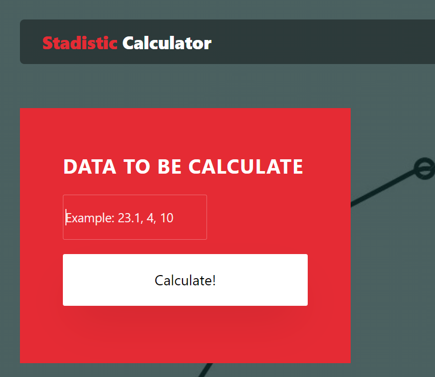

# LABORATORY - INTRODUCTION TO COMPUTER SYSTEM DESIGN. 🚀

## Escuela Colombiana de Ingeniería - Enterprise Architectures(AREP).

_Stadistic Calculator Spark: a program that serve for calculate the mean and standard deviation of a set of n real numbers in a web page._

## Getting Started

### Prerequisites

- [Maven](https://maven.apache.org/) - Dependency Management.

- [Java 8](https://www.oracle.com/co/java/technologies/javase/javase-jdk8-downloads.html) -  Development Environment.

- [Git](https://git-scm.com/) - Version Control System.

- [Spark](http://sparkjava.com/) - Micro framework for creating web applications in Java 8.

Make sure you have this programs installed correctly and the version that we need with the following commands:

```
mvn --version
```

```
git --version
```

```
java -showversion
```

### Installing

1. Clone the repository:

```
git clone https://github.com/angiedanielar/LAB2_AREP.git
```

2. Compile the projet:

```
mvn package
```

3. Executing the program:

```
mvn exec:java -D "exec.mainClass"="edu.escuelaing.arep.app.App"

And put this link in your browser: http://localhost:4567
```

- If you want to go to the website [click here](https://peaceful-chamber-69977.herokuapp.com/hello)


- **IMPORTANT:** To run locally you must change the url assigned to the post method since it is configured with Heroku. You must use this link: http://localhost:4567/calculator/calculate/ instead the heroku url as follow:


- **HOW TO USE THE APP:** You must enter the numbers separated by comma in the box that says data to be calculate (this box have a example), and then pressing the button that says "Calculate", the previously numbers typed will be displayed with their mean and standard deviation .


4. Generating the documentation:

```
mvn javadoc:javadoc
```

- [View Documentation Ubication](https://angiedanielar.github.io/LAB2_AREP/apidocs)

## Running the unit tests

```
mvn test
```

## Deploy

In the follow picture we can see the deployment diagram of my Spark app, where the user accesses the application using a web browser that communicates with the application hosted in heroku and once click the link he will be shown the web page created. 


The Spark app it is responsible for determining the behavior of the different requests made by customers when they insert the data to be calculate, and displayed the outcome of these calculations using an API which is assisted with the use of a LinkedList implementation.

## Test Data

In this laboratory we have test cases along with their respective mean and standard deviation. This information is in the two following tables that have the test data and the expected results.



The following are the results obtained:


Analyzing the results obtained we can see that correspond to the information stored in the previous tables and how there are equal to the expected we can conclude the program and the web page they behaves correctly when making the different calculations.

## Built With

- [Maven](https://maven.apache.org/) - Dependency Management

- [Java 8](https://www.oracle.com/co/java/technologies/javase/javase-jdk8-downloads.html) -  Development Environment.

- [Git](https://git-scm.com/) - Version Control System.

- [CircleCI](https://circleci.com/) [](https://app.circleci.com/pipelines/github/angiedanielar/LAB2_AREP) - Continuous Integration.

- [Spark](http://sparkjava.com/) - Micro framework for creating web applications in Java 8.

- [Heroku](https://www.heroku.com/platform) - Deploy platform.

## Inform

- [View the Design Inform](https://github.com/angiedanielar/LAB2_AREP/blob/master/Inform.pdf)

## Author

- Angie Daniela Ruiz Alfonso.


## License

This project is under GNU General Public License - see the [LICENSE](LICENSE) file for details.

